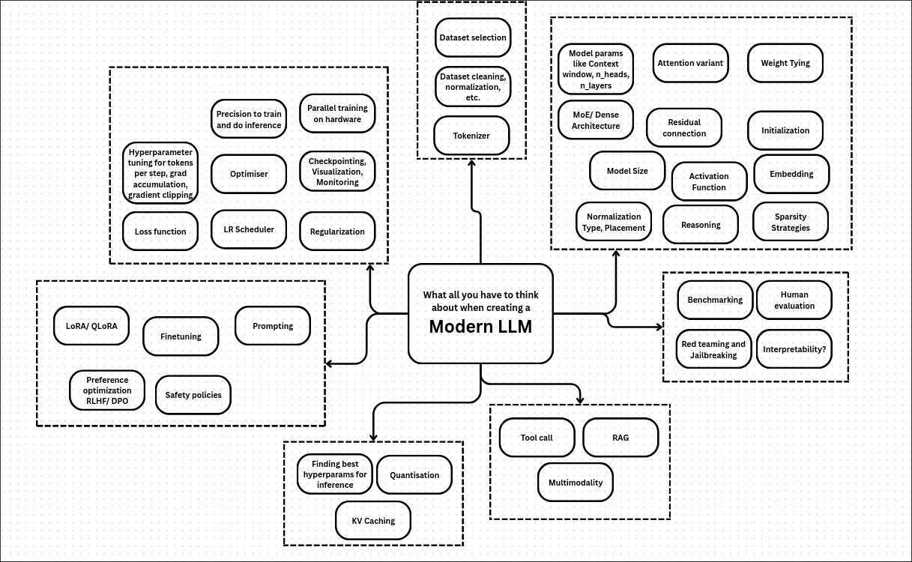

# Outline for Mastering LLMs (with Subtopics)

## 0. Prerequisites
- Python; Mathematics; ML; DL; 
- Absolute NLP Theory: https://www.youtube.com/watch?v=DzpHeXVSC5I&list=PLoROMvodv4rOaMFbaqxPDoLWjDaRAdP9D

## 1. Foundations
- Surveys & Trends
	- Learn the higher level overview of large language models, recent trends and future directions
		-  https://arxiv.org/pdf/2407.06204
		- https://www.labellerr.com/blog/exploring-architectures-and-configurations-for-large-language-models-llms/
		- https://arxiv.org/abs/2402.06196v3
		- https://arxiv.org/abs/2508.09834

## 2. Data
- Dataset selection
	- Important data sources and licenses
	- Data diversity and bias considerations
	- Data scaling laws: https://arxiv.org/abs/2203.15556
	- Synthetic data generation; importantce; problems
- Dataset cleaning and normalization
	- Deduplication
	- Data preprocessing
	- Filtering and quality checks
- Tokenizer
	- Byte Pair Encoding (BPE)
	- SentencePiece
	- Tokenization efficiencies and tradeoffs

## 3. Model Architectures
- High level overview of LLM architectures
	- https://magazine.sebastianraschka.com/p/from-gpt-2-to-gpt-oss-analyzing-the
- Base Architecture
	- Transformers and variants
		- Standard Transformer(Encoder-Decoder)
			- Attention Is All You Need: https://arxiv.org/abs/1706.03762
			- 3blue1brown: https://www.youtube.com/watch?v=LPZh9BOjkQs&list=PLZHQObOWTQDNU6R1_67000Dx_ZCJB-3pi&index=5
			- Andrej Karpathy videos: https://www.youtube.com/@AndrejKarpathy/videos
			- https://xmarva.github.io/blog/2025/building-a-transformer/
			- https://jalammar.github.io/illustrated-transformer/
			- https://www.youtube.com/watch?v=U0s0f995w14
			- https://lilianweng.github.io/posts/2018-06-24-attention/
			- https://mlabonne.github.io/blog/posts/2023-06-07-Decoding_strategies.html
		- Encoder only Transformer
			- BERT: https://arxiv.org/abs/1810.04805
			- T5: https://arxiv.org/pdf/1910.10683
		- Decoder only Transformer
			- GPT2: https://arxiv.org/abs/2005.14165
				- Fine tune:https://www.youtube.com/watch?v=elUCn_TFdQc
		- Reformer
			- https://arxiv.org/pdf/2001.04451
		-  Linformer, Performer, and models that use sparse attention patterns
		- nano-gpt speedrun
			- https://bbycroft.net/llm
	- Mixture of Experts (MoE)
		- Basics: https://www.datacamp.com/blog/mixture-of-experts-moe
		- Sparse activation, Routing strategies
		- Project - NanoMOE: https://cameronrwolfe.substack.com/p/nano-moe 
		- Routing strategies
	- State Space Models and Hybrids
		- Mamba
		- Hybrid (Transformer + Mamba) architectures
		- Jamba (AI21 Labs)
	- Learn architecture and all of popular LLMs(especially open-source)
		- https://magazine.sebastianraschka.com/p/the-big-llm-architecture-comparison
		- qwen
		- mixtral
			- https://arxiv.org/pdf/2401.04088
		- deepseek
		- moonshot
		- llama
			-  https://ai.meta.com/blog/meta-llama-3/
		-  gpt-oss: 
			- https://cameronrwolfe.substack.com/p/gpt-oss
			- https://arxiv.org/abs/2508.10925
- Attention mechanisms
	- Multi-Head Attention (MHA)
	- Multi-Query Attention (MQA)
	- Grouped-Query Attention (GQA)
	- Multi-Head Latent Attention (MLA)
	- Flash attention
		- https://arxiv.org/abs/2205.14135
		- https://github.com/Dao-AILab/flash-attention
	- Efficient attention variants

- Model size
	- Learn how size affects performance for various tasks
- Residual connections
	- Pre-norm vs post-norm
- Weight tying
	- Input/output embeddings
- Initialization
	- Xavier (or Glorot) Initialization
	- He Initialization
- Embeddings
	- Positional embeddings
	- Rotary Positional Embeddings (RoPE)
		- https://huggingface.co/docs/transformers/model_doc/roformer
		-  https://arxiv.org/abs/2104.09864
	- ALiBi (Attention with Linear Biases)
		- https://arxiv.org/abs/2108.12409#:~:text=efficient%20position%20method%2C%20Attention%20with,to%20outperform%20multiple%20strong%20position
- Normalization
	- LayerNorm
	- RMSNorm
		-  https://arxiv.org/abs/1910.07467
	- ScaleNorm
	- Placement strategies (pre-norm, post-norm)
- FFN activation functions for FFN layer
	- https://cameronrwolfe.substack.com/p/nano-moe
	- ReLU
	- GELU
		- https://arxiv.org/abs/1606.08415
	- GLU
		- https://arxiv.org/abs/2002.05202
	- SwiGLU

- Reasoning modules
	- Self-reflection loops
	- Multi-token prediction (MTP)
- Sparsity strategies
	- Sparse attention
	- Hybrid sparse-dense models

## 4. Optimization & Training
- Loss functions
	- Cross-entropy
	- Custom loss for specific tasks
- Optimizers
	- SGD
	- Adam
	- AdamW
		- https://arxiv.org/abs/1711.05101#:~:text=,from%20the%20setting%20of%20the
	- Lion 
	- Muon optimizer
		-  https://arxiv.org/abs/2502.16982
		-  https://kellerjordan.github.io/posts/muon/
- LR scheduler
	- Warmup strategies
	- Cosine annealing
	- Step decay
- Regularization
	- Dropout
	- Weight decay
	- Stochastic Depth (LayerDrop)
- Precision for training and inference
	- BF16
	- FP16, FP32
	- Mixed precision training
- Parallel training on hardware
	- Data parallelism
	- Model parallelism
	- Pipeline parallelism
- Checkpointing, visualization, monitoring
	- Checkpointing strategies
	- Training dashboards
	- Monitoring metrics
- Hyperparameter tuning
	- Tokens per step
	- Gradient accumulation
	- Gradient clipping
- Quantization and distillation
	- https://arxiv.org/abs/2210.17323
	- https://mlabonne.github.io/blog/posts/Introduction_to_Weight_Quantization.html
	- https://mlabonne.github.io/blog/posts/Quantize_Llama_2_models_using_ggml.html
	- https://mlabonne.github.io/blog/posts/4_bit_Quantization_with_GPTQ.html
	- https://medium.com/friendliai/understanding-activation-aware-weight-quantization-awq-boosting-inference-serving-efficiency-in-10bb0faf63a8
	- https://github.com/mit-han-lab/smoothquant/blob/main/examples/smoothquant_llama_demo.ipynb
	- https://www.deepspeed.ai/tutorials/model-compression/
	- Model quantization (FP8, INT8)
	- Knowledge distillation
	- Low-bit attention kernels (SageAttention, FlashAttention-3)
- Finding best hyperparameters for inference
	- Batch size, Sequence length and other model parameters
- KV caching
	- Memory management
	- Throughput optimization
#### Some techniques to know
- Curriculum Learning
- Data Packing (Mixture / Packing)
- Gradient Clipping
- Mixed Precision (FP16/BF16)
- Activation Checkpointing
- ZeRO / Sharded Data Parallelism
- Weight tying
- Layer sharing
- KV cache layout and memory
- **Distillation**
- **Auxiliary heads**

## 5. Fine-Tuning & Preference Learning
- Finetuning
	- Full model finetuning
	- Domain adaptation
- Parameter-efficient fine-tuning
	-  https://www.superannotate.com/blog/llm-fine-tuning
	- https://huggingface.co/blog/mlabonne/sft-llama3
	- https://www.youtube.com/watch?v=iOdFUJiB0Zc
	- https://www.youtube.com/watch?v=bZcKYiwtw1I
	- Adapters: https://xmarva.github.io/blog/2025/adapters/
	- LoRA / QLoRA
		- https://lightning.ai/pages/community/lora-insights/
		- Low-rank adaptation techniques
		- Efficiency gains
- Preference learning
	- Reinforcement Learning from Human Feedback (RLHF)
		- https://huggingface.co/blog/rlhf
		- https://magazine.sebastianraschka.com/p/llm-training-rlhf-and-its-alternatives
		- 
	- Direct Preference Optimization (DPO)
		- https://arxiv.org/abs/2305.18290
		- https://huggingface.co/blog/pref-tuning
		- https://mlabonne.github.io/blog/posts/Fine_tune_Mistral_7b_with_DPO.html
		- https://wandb.ai/alexander-vishnevskiy/dpo/reports/TRL-Original-DPO--Vmlldzo1NjI4MTc4
- Prompting
	- Prompt engineering
	- Zero-shot, few-shot, and instruction prompting
- AI Safety
	- Alignment techniques
	- AI Interpretability
		- Circuits theory

## 6. Inference & Systems
- Inference optimization
	- https://xmarva.github.io/blog/2025/inference-optimization/
	- https://github.com/ggml-org/llama.cpp
	- Latency reduction
	- Throughput maximization
- Sparse and hybrid scaling
	- Exploiting sparsity for efficiency
	- Hybrid model deployments
- Post-attention innovations
	- QK-Norm (RMSNorm on queries/keys pre-RoPE)
	- Multi-Token Prediction (speculative decoding)
- Tool call
	- Integrating external tools and APIs
- RAG (Retrieval-Augmented Generation)
	- Retrieval integration
	- Memory and knowledge augmentation
- Multimodality
	- Multimodal training strategies
	- Vision-language models

## 7. Evaluation & Safety
- Benchmarking
	- https://github.com/huggingface/evaluation-guidebook
	- Standard benchmarks (MMLU, HELM, etc.)
	- Custom evaluation tasks
- Human evaluation
	- Manual assessment protocols
	- Crowdsourced evaluation
- Red teaming and jailbreaking
	- Adversarial testing
	- Jailbreak detection and mitigation
- Interpretability
	- Model probing techniques
	- Visualization of attention and activations

# Other useful resources
- HRM (inference optimization topic) - https://xmarva.github.io/blog/2025/inference-optimization/
- How to train LLMs - https://medium.com/@pacosun/how-to-train-massive-language-models-without-losing-your-mind-333840824114#:~:text=Learning%20Rate%20Warm
- Cohere class on LLMs as blogs(really good) - https://cohere.com/llmu
- Another class (really good) - https://github.com/mlabonne/llm-course
- https://parlance-labs.com/education/
- https://docs.unsloth.ai/
- https://mlabonne.github.io/blog/posts/Fine_tune_Mistral_7b_with_DPO.html
- https://machinelearningmastery.com/the-roadmap-for-mastering-language-models-in-2025/ - continue from deploy as it was not added here(things like langchain)

# Popular tutorials/ projects
- Make a tokenizer from scratch
- Implement the muon optimizer
- Implement all the attention mechanism which are relevant
- Implement embeddings like RoPE
- Try out different types and styles of normalization
- Implement the Mamba architecture
- Integrate QLoRA fine-tuning
- Create a full Mixture of Experts (MoE) based LLM
	- Experiment with types of activation functions
	- Explore various optimizers
	- Apply RLHF and DPO techniques
	- Integrate FlashAttention
	- Quantize it into 4-bit or something similar
	- Add optimizations such as KV cache
#### Super optional
- Create a multimodal integrated LLM
- Add RAG and tool-calling capabilities